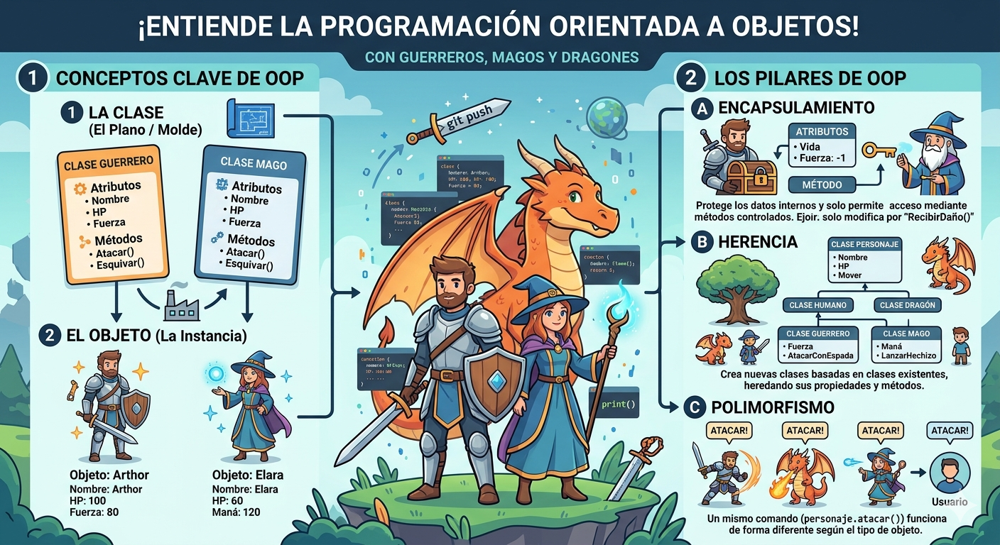

# Prog. Orien. a Obj.
Introduccion a la Programacion Orientada a Objetos en Python

## Porque aprender P.O.O?

- Imagina que quieres crear tu propio Juego, tienes Guerreros, Magos, Dragones.. etc, cada uno consus propias habilidades, PV, y ataques. ¿Como los organizas en codigo SIN repetir todo una y otra y otra y otr..?

- La **Programacion Orientada a 0bjetos** es la respuesta. En lugar de escribir instrucciones sueltas, modelas el Mundo Real con *objetos* que tienen Caracteristicas y Comportamientos. Siendo la forma baase en la que muchos *Programas Profesionales* estan hechos



## Clase y Objeto

- Una CLASE es un tipo de dato cuyas variables se llaman -OBJETOS o -instancias

- La CLASE es la definicion del concepto* del Mundo Real y los -OBJETOS o -instancias son el propio "OBJETO" del Mundo Real

- Las CLASES estan compuestos por dos elementos:
    - **Atributos:** Informacion que  ALMACENA la clase
    - **Metodos:** Operaciones que pueden REALIZARSEN con la clase

## Definicion de una CLASE en Python

```py
class NombreClase:

    def __init__(self, variable1, variable2):
        self.atributo1= valor1
        self.atributo2= valor2

    def NombreMetodo(self):
        BloqueCodigo
```

- `class`: Palabra reservada en Python para definir una CLASE
- `NombreClase`: Nombre de la CLASE que se quiere crear
- `def`: Palabra reservada en Pyton para definir tanto al Constructor de la CLASE (metodo que se ejecuta al usar una CLASE por primera vez) como a los diferentes metodos que tiene
- `__init__`: Plabra reeservada en Python para definir el Metodo Constructor de la CLASE, le metodo __inif__ es una de las cosas que primero se ejecutan al crear una CLASE
- `(self, variableX)`: Parametro del Constructor de la CLASE, El parametro **self** es OBLIGATORIO para despues poder tener tantos parametros como quierass :D, y la forma de añadir parametros es la misma que en las funciones
- `(self, atributoX)`: Forma de utilizacion y acceso a los atributos de la CLASE
- `NombreAtributo`: Nombre del metodo de la CLASE
- `self`:Parametro del Constructor de la CLASE, El parametro **self** es OBLIGATORIO para despues poder tener tantos parametros como quierass :D, y la forma de añadir parametros es la misma que en las funciones
- `BloqueCodigo`: Instrucciones que ejecuta el metodo

**Al definir una CLASE, !Ten en cuenta!**
- Puedes definir TANTOS atrubutos como necesites :3
- Pwedes definir TANTOS metodos como necesites :3
- Puedes definir TANTOS parametros en el Constructor y en los metodos como necesites -w-"

## Ejemplo 1:

- Crear una CLASE que represente a una Persona
- Atributos: nombre, apellidos y edad
- Metodos: mostrar info de la persona

```py
class Persona:
    def __init__(self, nombre, apellido, edad):
        self.nombre= nombre
        self.apellido= apellido
        self.edad= edad

    def mostrarPersona(self):
        print("Nombre: ", self.nombre)
        print("Apellidos: ", self.apellido)
        print("Edad: ", self.edad)

def main():
    print("Vamos a  aprender P.O.O en Python...")
    persona1= Persona("Lorenzo", "Perez", 18)
    persona1.mostrarPersona()


if __name__ == "__main__":
    main()
```

## Representacion de RAM del Objeto Creado


(perdon profe por usar su imagen pero no tengo wifi para generarla ni me se el prompt :">)

## Composicion

- Consiste en la creacion de nuevas CLASES a partir de otras CLASES ya existentes que actuan como elementos compositores de la nueva CLASE
- Las CLASES existentes seran atributos de la nueva CLASE

### Ejemplo

- Una coordenada en 2Dimensiones esta compuesta por dos valores; el eje X y el eje Y. Esto puede ser una CLASE
- Un cuadrado esta compuesto por 4 coordenadas que son los 4 vertices, Esto puede ser otra CLASE que esta compuesta por cuatro CLASES del objeto coordenada

### Codigo Python

```py
class Coordenada:
    def __init__(self, x, y):
        self.X= x
        self.Y= y

    def mostrarCoordenada(self):
        print("(",self.X,",",self.Y,")")

class Cuadrado:
    def __init__(self, v1, v2, v3, v4):
        self.V1= v1
        self.V2= v2
        self.V3= v3
        self.V4= v4

    def mostrarVertices(self):
        print("El cuadrado esta compuesto por los siguientes vertices: ")
        self.V1.mostrarCoordenada()
        self.V2.mostrarCoordenada()
        self.V3.mostrarCoordenada()
        self.V4.mostrarCoordenada()
```

## Representacion de la RAM en composicion


(perdon profe por usar su imagen pero no tengo wifi para generarla ni me se el prompt :">)

## Encapsulacion

- Uno de los objetivos que tiene la P.O.O es proteger los datos de acceso o uso no controlados, siendo esto lo que se conoce como **Encapsulacion**
- Los datos (atributos) que componen una clase pueden ser dos tipos:
    - **Publicos**: Los datos son accesibles sin control, osea, que los datos pueden ser usados SIN ningun tipo de mecanismo que proteja ante usos No-Autorizados o indebidos
    - **Privados**: Los datos NO pueden ser accedidos SIN control y para acceder a ellos se debera crear un mecanismo qeu brinde el acceso a los datos, de esta manera los datos seran -unicamente- accedidos por la misma clase

- La encapsulacion tambien puede realizarse sobre los metodos
- La definicion de atributos -privados- se hace incluyendo doble rayapiso ("__") entre la palabra "*self*" y el nombre del atributo (ejemplo "`self.__x`")

### Codigo Python

```py
class Coordenada:
    def __init__(self, x, y):
        self.__X= x
        self.__Y= y

    def getX(self):
        return self.__X
    def setX(self, x):
        self.__X= x

    def getY(self):
        return self.__Y
    def setY(self, Y):
        self.__Y= Y

    def mostrarCoordenada(self):
        print("(",self.__X,",",self.__Y,")")

class Cuadrado:
    def __init__(self, v1, v2, v3, v4):
        self.V1= v1
        self.V2= v2
        self.V3= v3
        self.V4= v4

    def mostrarVertices(self):
        print("El cuadrado esta compuesto por los siguientes vertices: ")
        self.V1.mostrarCoordenada()
        self.V2.mostrarCoordenada()
        self.V3.mostrarCoordenada()
        self.V4.mostrarCoordenada()
```

## Herencia

- Permite la reutilización de código.
- Consiste en la definición de una clase utilizando como base una clase ya existente.
- La nueva clase derivada tendrá todas las caracteristicas de la clase base y ampliará el concepto de esta, es decir, tendrá todos los atributos y métodos de la clase base.
- Significa que entre dos clases existe una relación del tipo "es un".
- La herencia en Python se especifica de la siguiente manera: `class NombreClase(ClaseBase):`
- Ejemplo:
    - Pensemos en una persona como una clase, la persona tendría una serie de atributos como pueden ser el nombre, los apellidos, la edad, etc.  Esas características de una persona serían compartidas por todas aquellas clases hijas como pueden ser alumno y profesor.  Es decir, alumno y profesor heredarían las propiedades de la clase persona y tendrían sus propias propiedades, diferentes entre ellas, como por ejemplo el curso en el que está el alumno y el horario de tutorias del profesor.

    - Clase base: Persona
        - Atributos:
            - Nombre
            - Apellidos
            - Edad

    - Clase derivada: Alumno
        - Atributos:
            - Curso
            - Asignaturas
    
    - Clase derivada: Profesor
        - Atributos:
            - Antigüedad
            - Tutorias
            - Teléfono
